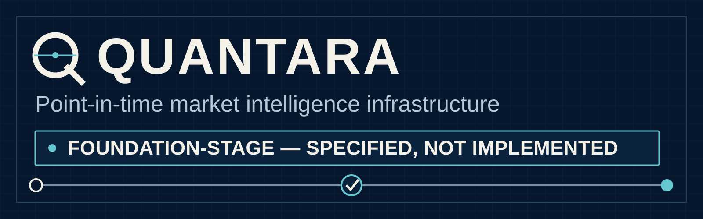
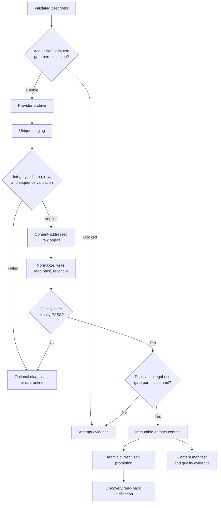

# Quantara



> **FOUNDATION-STAGE — SPECIFIED, NOT IMPLEMENTED**
> Quantara currently publishes engineering contracts and repository standards. It does not yet ship executable ingestion, market-data, machine-learning, backtesting, or trading software.

**No trading signals. No production execution. No performance claims.**

Quantara is correctness-first infrastructure for reproducible market-data and machine-learning research. Its first bounded target is an auditable archive-to-canonical data slice for Binance USD-M `BTCUSDT` perpetual one-minute data from January 2024.

[Read the first data-slice specification](docs/superpowers/specs/2026-08-24-binance-btcusdt-perpetual-january-2024-data-slice-design.md) · [Review the roadmap](#roadmap) · [Contribute](CONTRIBUTING.md)

## Why Quantara exists

Quantitative research can look reproducible while depending on data that was unavailable at decision time, silently incomplete, numerically ambiguous, or transformed without verifiable provenance. Quantara treats those failures as contract violations—not modeling details.

The project is being built one bounded vertical slice at a time. Each slice must make its source, legal-use decision, temporal assumptions, canonical representation, quality state, and content identity reviewable before broader capabilities are added.

## Specified design invariants

These are **specified requirements, not claims about running software**:

- **Point-in-time-aware consumption:** later knowledge must not enter an earlier research decision.
- **Exact canonical values:** currency and volume fields use decimal-safe representations rather than binary floating point.
- **Temporal validation:** validation respects event order; random train/test splitting is out of scope.
- **Deterministic content identity:** logical content receives deterministic SHA-256 identity, while each operational attempt retains separate timestamped and UUID-addressed evidence.
- **Quality-gated publication:** **No canonical promotion without `PASS`**.
- **Immutable canonical content:** publication produces content-addressable, verifiable artifacts rather than silently replaced datasets.

For the first historical slice, nominal closed-candle availability is recorded and same-close execution assumptions are forbidden. The archive does **not** reconstruct historical exchange publication time, receipt time, network latency, processing latency, or order latency. Point-in-time safety is therefore bounded by the timestamp evidence actually available.

## Current bounded scope

The approved first slice specifies:

- Binance USD-M Futures;
- `BTCUSDT` perpetual;
- one-minute klines;
- January 2024 UTC;
- archive-first acquisition and canonical normalization.

Live collectors, higher-timeframe derivation, features, labels, models, backtesting, execution, APIs, and user interfaces are not current capabilities.

## Specified first-slice flow — not implemented



This summary preserves the first slice’s key boundaries: separate legal-use gates for governed operations, unique staging, verified raw retention, normalization reconciliation, an exact `PASS` gate, immutable commit publication, atomic `current.json` promotion, and discovery read-back. Every acquisition attempt—including legal rejection, validation failure, quality ineligibility, operational failure, and success—must produce the attempt evidence required by the specification. Deterministic content identity remains distinct from per-attempt operational provenance.

## Current specification

The [Binance BTCUSDT perpetual January 2024 data-slice design](docs/superpowers/specs/2026-08-24-binance-btcusdt-perpetual-january-2024-data-slice-design.md) is the authoritative contract for the first vertical slice. Its detailed schema, hashing rules, timestamp semantics, legal-use states, and publication invariants are not duplicated here.

## Repository map

```text
.
├── .github/                 Issue forms and pull-request controls
├── docs/
│   ├── assets/              Deterministic repository visual sources
│   └── superpowers/
│       ├── plans/           Approved bounded implementation plans
│       └── specs/           Reviewed technical contracts
├── CITATION.cff             Preferred citation metadata
├── CODE_OF_CONDUCT.md       Community standards and private reporting
├── CONTRIBUTING.md          Correctness-first contribution workflow
├── LICENSE                  Apache License 2.0
├── SECURITY.md              Private vulnerability reporting policy
└── README.md                Repository front door
```

No empty API, tutorial, package, source, or speculative architecture directories are maintained before real artifacts exist.

## Roadmap

### Implemented and verified

- No executable market-data or ML capabilities yet.

### Specified but not implemented

- The Binance USD-M `BTCUSDT` perpetual one-minute archive-to-canonical slice for January 2024.
- Descriptor validation, operation-specific legal-use gates, unique staging, integrity validation, deterministic content identity, immutable publication, and attempt/content evidence.

### Planned

- A tested archive-to-canonical reference implementation.
- Higher-timeframe derivation from the canonical one-minute base.
- Feature and label contracts with leakage-resistant temporal validation.
- Research evaluation and calibration workflows.

Live collection, forecasting models, backtesting, portfolio construction, and order execution require separate design and verification gates.

## Engineering and contribution standards

The required sequence is:

> Define → Risk-review → Design → Test → Bounded implementation → Verification → Stabilization

A contribution is not accepted because it is plausible or because unit tests happen to be green. Review must address temporal ordering, leakage risk, provenance, legal-use state, deterministic serialization, failure paths, and live behavior where applicable.

See [CONTRIBUTING.md](CONTRIBUTING.md) for the contribution contract, [SECURITY.md](SECURITY.md) for private vulnerability reporting, and [`CITATION.cff`](CITATION.cff) for citation metadata.

## Licensing, data rights, and responsible use

Original Quantara repository material is licensed under the [Apache License 2.0](LICENSE). That license does **not** relicense third-party market data, exchange/provider content, trained artifacts, model weights, names, or trademarks.

Raw and normalized Binance artifacts for the first slice remain restricted to private/internal evaluation while commercial-use rights are unresolved. Users are responsible for provider terms, data rights, and applicable law.

Quantara is research and engineering software. It is not investment advice, a recommendation, a representation of expected performance, or a warranty of data fitness. Financial markets involve substantial risk; users remain responsible for independent validation and decisions.
