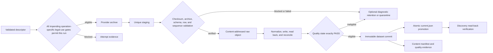

# Quantara Professional Repository Presentation — Design Specification

**Status:** Approved — implementation not started
**Date:** 2026-08-24  
**Project:** Quantara  
**Project root:** `D:\PROJECT\Quantara`  
**Repository:** `https://github.com/wyze69-sys/Quantara`  
**Audience:** Open-source quantitative developers, data engineers, and ML researchers

## 1. Purpose

This specification defines a bounded professionalization pass for Quantara's public GitHub repository. The pass will give the project a credible, navigable, and legally usable front door while preserving the distinction between what is implemented, what is specified, and what is merely planned.

The repository presentation must communicate Quantara's engineering standards without presenting the project as a finished trading, forecasting, or machine-learning product. The governing principle is:

> Earn technical trust through precise scope, inspectable evidence, and explicit maturity states—not through promotional claims.

## 2. Approved direction

The approved presentation approach is **evidence-first engineering**, with selected research-lab transparency.

Approved decisions:

- The primary audience is open-source quant developers, data engineers, and ML researchers.
- The repository will use the Apache License 2.0 for original Quantara repository material for which the owner holds licensing rights, including code, documentation, original visual assets, and repository configuration.
- The repository voice will be technical, precise, transparent, and conservative about unfinished capability.
- The visual identity will be restrained and institutional rather than promotional or crypto-themed.
- The README will be concise and will link to authoritative specifications instead of duplicating them.
- Every capability claim will be labeled as implemented and verified, specified but not implemented, or planned.
- Repository health and governance files will be added without speculative development scaffolding.
- GitHub metadata and feature settings will be configured to match the project's actual maturity.
- The existing historical-data specification will not be relocated in this pass.
- No executable code, CI workflow, package configuration, fake coverage indicator, release, API, model, or trading functionality will be introduced by this presentation subproject.

## 3. Goals

The implementation must:

1. Explain Quantara's purpose and foundation-stage maturity before the reader reaches roadmap or future-capability content.
2. Show the repository's current maturity before describing future capability.
3. Make the first approved technical specification easy to discover.
4. Establish a factual visual and editorial identity.
5. Define contribution, conduct, security, citation, and licensing expectations.
6. Give contributors issue and pull-request templates tailored to temporal safety, data provenance, and quality incidents.
7. Set accurate GitHub description, topics, and repository feature settings.
8. Produce visual assets that are deterministic, accessible, and inspectable.
9. Keep all external links, metadata, and structured files valid.
10. Verify the live GitHub result after publication.

## 4. Non-goals

This pass will not:

- implement ingestion, normalization, validation, storage, features, labels, models, backtesting, execution, APIs, or user interfaces;
- claim production readiness, profitability, predictive performance, investment suitability, or regulatory compliance;
- create placeholder packages, empty source trees, fake examples, fake screenshots, or speculative APIs;
- add CI, test, coverage, package, release, or documentation badges whose backing automation does not exist;
- publish or commit Binance archives, normalized datasets, credentials, local paths, or generated research artifacts;
- relicense Binance data, exchange content, third-party trademarks, or future third-party dependencies;
- move the existing approved data-slice specification solely for cosmetic consistency;
- open empty community surfaces such as Discussions, Wiki, Projects, or a documentation website.

## 5. Audience and trust model

### 5.1 Primary readers

The repository must serve:

- quantitative developers evaluating correctness and temporal-safety assumptions;
- data engineers evaluating provenance, schema, and validation boundaries;
- ML researchers evaluating reproducibility and leakage controls;
- prospective contributors deciding where the project is real, where it is specified, and where it is still planned.

### 5.2 Reader questions the front door must answer

A reader should be able to determine:

1. What is Quantara intended to become?
2. What exists today?
3. What is the first bounded scope?
4. What correctness invariants distinguish the project?
5. Where is the authoritative technical contract?
6. How is third-party market data treated?
7. How can a contribution or quality incident be reported?
8. What is explicitly outside the current scope?

### 5.3 Trust rule

The repository must not rely on visual polish as evidence. Trust must come from linked specifications, precise status labels, reviewable assets, and verifiable repository state.

## 6. Capability-claim policy

Every material capability statement must map to exactly one state:

- **Implemented and verified:** executable behavior exists and has current verification evidence.
- **Specified but not implemented:** an approved technical contract exists, but executable behavior does not.
- **Planned:** direction exists without an approved implementation contract.

Artifact status and capability status are separate:

- **Delivered artifact:** the approved first-slice design specification exists in Git.
- **Capability status — specified but not implemented:** the BTCUSDT January 2024 archive-to-canonical behavior has an approved contract but no executable implementation.
- **Capability status — planned:** higher timeframes, live collection, features, labels, models, backtesting, execution, APIs, and UI lack an approved executable implementation.

The word **Delivered** may describe a named document or other repository artifact. It may describe a software capability only when that capability is implemented and verified. A delivered specification never makes its subject capability delivered.

The README must not use an unlabeled future-tense feature list that could be mistaken for present capability. Design invariants may be described as intended guarantees only when the wording makes their pre-implementation status explicit.

## 7. Identity and editorial system

### 7.1 Name and descriptors

- Project name: **Quantara**
- Primary descriptor: **Point-in-time market intelligence infrastructure**
- Positioning sentence: **Correctness-first infrastructure for reproducible market-data and machine-learning research.**
- Required external-context status: **FOUNDATION-STAGE — SPECIFIED, NOT IMPLEMENTED**

The descriptor and positioning sentence describe project direction, not current implementation. Whenever either appears outside explanatory README context—including header art, social preview, or repository metadata—it must be paired with visible foundation-stage or specified-not-implemented wording. Quantara is currently an open-source, foundation-stage research and engineering repository. Its approved long-term direction is a commercial crypto-only product, subject to separate implementation, evidence, legal, and production-readiness gates. This statement does not imply that commercial use of Binance data has been approved.

### 7.2 Voice

Repository copy must be:

- direct rather than promotional;
- specific rather than aspirational;
- evidence-led rather than adjective-led;
- readable by technical contributors without assuming knowledge of the prior design conversation;
- explicit about limitations, provider obligations, and non-goals.

Avoid:

- profit, alpha, signal, edge, or guaranteed-performance language;
- claims that Quantara predicts markets or enables production trading;
- exaggerated AI terminology;
- generic slogans such as "revolutionizing finance";
- crypto-token, coin, rocket, robot, brain, or trader imagery;
- fake metrics, fake terminal output, fake hashes, or fabricated screenshots.

### 7.3 Palette

- Midnight navy: `#07182E`
- Warm white: `#F4F1E8`
- Muted cyan: `#66C8D1`
- Slate: `#7792A8`

The design must retain sufficient contrast for text and essential diagram elements. Color must not be the only indicator of state.

### 7.4 Typography and layout

- Use a geometric sans-serif style with system-safe or path-independent rendering.
- Use a strong grid, generous whitespace, and sparse technical labeling.
- Do not depend on remotely hosted fonts.
- The project name must remain readable at reduced README and social-card sizes.

## 8. Visual assets

### 8.1 Header asset

Create `docs/assets/quantara-header.svg` as a hand-authored, deterministic SVG.

Required composition:

- Quantara name;
- primary descriptor;
- exact visible status text **FOUNDATION-STAGE — SPECIFIED, NOT IMPLEMENTED**;
- restrained left-to-right data-flow motif;
- source market observations entering validation gates;
- validated structured output;
- no implication that the output is a trading recommendation or price forecast.

The approved generated concept is directional inspiration only. It is not a final repository artifact and must not be committed as a verified technical diagram.

### 8.2 SVG requirements

The final SVG must:

- contain exact, reviewable text;
- include accessible title and description elements;
- declare an appropriate image role or otherwise support meaningful README alt text;
- avoid scripts, external resources, embedded raster payloads, remote fonts, and tracking content;
- render correctly without network access;
- use a responsive `viewBox`;
- remain legible on GitHub's light and dark page contexts because its own background is explicit;
- pass XML parsing and visual inspection.

### 8.3 Social preview

Create a deterministic raster export from a committed, simplified SVG source derived from the same design if GitHub requires a raster upload. The simplified source must be retained at `docs/assets/quantara-social-preview.svg` if a distinct composition is needed; otherwise `docs/assets/quantara-header.svg` is the source. The implementation plan must record the renderer, version, command, dimensions, and output hash.

The social preview must contain only:

- Quantara;
- the primary descriptor;
- exact visible status text **FOUNDATION-STAGE — SPECIFIED, NOT IMPLEMENTED**;
- one validation-to-canonical motif.

It must not contain tiny field labels, fake checksums, badges, price claims, or dense architecture text. The exact export size must follow GitHub's current documented requirements at implementation time rather than a stale hard-coded assumption in this design. The implementation evidence must record the authoritative documentation URL and access date.

### 8.4 Technical architecture diagram

The README architecture graphic will use Mermaid, not the decorative header. Its intended information flow is:



This summary diagram does not expand every operational failure edge. Every terminal outcome—including successful completion, legal-use rejection, validation or quality ineligibility, and operational failure—must produce the per-attempt evidence required by the authoritative first-slice specification. The arrow to Attempt evidence depicts the legal-gate rejection path only and is not an exhaustive topology.

The diagram must be introduced as **Specified first-slice flow — not implemented**. The implementation may improve labels or layout, but it must preserve descriptor validation and operation-specific legal-use gating before any governed action, unique staging, verified content-addressed raw retention, normalization reconciliation, the exact `PASS` quality gate, optional rather than universal quarantine, immutable commit publication, atomic discovery promotion, read-back verification, and the distinction between per-attempt evidence and deterministic logical content identity.

## 9. README information architecture

Create `README.md` with the following ordered sections.

### 9.1 Hero and status

The opening must include:

- the SVG header;
- one-sentence positioning;
- a visible status callout such as **Foundation — first vertical slice specified**;
- a direct statement that Quantara does not currently provide trading signals or production trading software;
- compact links to the current specification, roadmap section, and contribution guide.

At a `1280 × 800` viewport, the project name, descriptor, foundation-stage status, and non-trading disclaimer must be visible before the first scroll. At `375 × 812`, the project name, descriptor, and foundation-stage status must be visible in the first viewport, with the disclaimer no later than the second viewport.

Badges are limited to factual, backed state. The Apache 2.0 license badge may be included. CI, coverage, release, package, and documentation badges must wait until their systems exist.

### 9.2 Why Quantara exists

Briefly explain the failure modes Quantara is designed to prevent:

- temporal leakage;
- unverifiable data transformations;
- floating-point ambiguity in market values;
- silently incomplete, reordered, duplicated, or corrupted datasets.

Explain that Quantara treats these as engineering contract violations rather than routine research inconvenience.

### 9.3 Intended core guarantees

Summarize these design invariants:

- intended point-in-time-aware design, bounded by the timestamp evidence actually available;
- deterministic logical content identity paired with immutable per-attempt operational provenance;
- decimal-safe canonical values;
- explicit closed-candle temporal semantics and leakage-aware consumption boundaries;
- no canonical promotion without a `PASS` quality state.

The section must explicitly label them as intended or specified invariants until implementation verifies them. For the current slice, it must explain that nominal closed-candle availability is recorded and same-close execution assumptions are forbidden, but historical exchange publication, receipt, network, processing, and order latency are not reconstructed.

### 9.4 Current bounded scope

State the first approved scope:

- Binance USD-M Futures;
- BTCUSDT perpetual;
- one-minute klines;
- January 2024 UTC;
- archive-first acquisition and canonical normalization.

List current exclusions: live collectors, higher-timeframe derivation, features, labels, models, backtesting, execution, APIs, and UI.

### 9.5 System flow

Include the Mermaid diagram defined in Section 8.4 and a short explanation of immutable landing, validation, quarantine, canonical promotion, and manifests.

### 9.6 Current specification

Link directly to:

`docs/superpowers/specs/2026-08-24-binance-btcusdt-perpetual-january-2024-data-slice-design.md`

Describe it as the authoritative contract for the first vertical slice. Do not restate its detailed schema, hashing rules, or legal-use state machine in the README.

### 9.7 Repository navigation

Include a compact map of paths that actually exist after the presentation pass. Do not show future directories as if they exist.

### 9.8 Roadmap

Use the capability states from Section 6 consistently:

- **Implemented and verified**
- **Specified but not implemented**
- **Planned**

Delivered documentation may appear in a separate **Repository artifacts** list where each item is explicitly named as a document or repository asset. Roadmap items must be capability-based rather than date-based or percentage-based. The first implementation milestone is the verified archive-to-canonical vertical slice. Later items must not imply approved designs when none exist.

### 9.9 Engineering and contribution standards

Summarize testing, reproducibility, security reporting, contribution workflow, and citation. Link to the dedicated files rather than reproducing them.

### 9.10 License, data rights, and responsible use

State:

- original Quantara repository material for which the owner holds licensing rights—including code, documentation, original visual assets, and repository configuration—is licensed under Apache 2.0;
- market data and provider content retain their own terms and are not relicensed by Quantara;
- users are responsible for provider terms and applicable law;
- Quantara is research and engineering software, not investment advice;
- no performance, fitness, or warranty representation is made.

## 10. Repository health files

### 10.1 `LICENSE`

Use the official, unmodified Apache License 2.0 text. Copyright notices, if added outside the license body, must use accurate ownership and year information.

### 10.2 `CONTRIBUTING.md`

Define:

- the bounded-subproject workflow;
- requirement to discuss or specify material scope before implementation;
- test and verification evidence expectations;
- point-in-time and leakage review;
- data provenance and migration impact review;
- documentation expectations;
- pull-request scope and review requirements;
- prohibition on committing market data, credentials, or generated local artifacts.

Do not invent installation or test commands before executable tooling exists.

### 10.3 `CODE_OF_CONDUCT.md`

Use the official Contributor Covenant 2.1 text. Replace its enforcement placeholder with a tested, operational private conduct-reporting route before publication. The route must have an approved recipient, access control, and monitoring responsibility; it must not promise unsupported confidentiality or response times. Do not use the vulnerability-advisory channel for conduct reports, and do not publish a personal email address without explicit approval.

### 10.4 `SECURITY.md`

Define:

- a private security reporting path;
- latest `main` as the initially supported state;
- information reporters should provide;
- expected acknowledgement language without promising an unsupported response deadline;
- distinction between security vulnerabilities and data-quality incidents.

If GitHub private vulnerability reporting is available and enabled for the repository, it is the preferred path. Otherwise implementation must stop and obtain approval for an alternative private contact route rather than fabricate one.

### 10.5 `CITATION.cff`

Include:

- valid CFF version;
- project title;
- author identity approved for academic/public use;
- repository URL;
- Apache-2.0 license identifier;
- concise project message.

Do not invent a DOI, release version, affiliation, ORCID, or publication date. Implementation requires explicit approval of the public citation identity before generating or pushing `CITATION.cff`. That approval must cover exact spelling, capitalization, whether the author is represented as a person or entity, and the exact CFF field mapping. Use `repository-code` for the repository URL and `license: Apache-2.0`; do not infer name-part boundaries.

## 11. GitHub templates

### 11.1 Bug report

Create `.github/ISSUE_TEMPLATE/bug_report.yml` requiring:

- concise description;
- reproduction steps;
- expected and actual behavior;
- environment details;
- relevant logs with secret-removal guidance;
- confirmation that the report is not a private security vulnerability.

### 11.2 Data-quality incident

Create `.github/ISSUE_TEMPLATE/data_quality_incident.yml` with stable, unique field IDs. Provider, market/symbol/interval, affected UTC range, observed invariant failure, reproducibility evidence, and the restricted-data confirmation are required. Source checksum and manifest identifiers may be optional because a reporter may not possess them. The form requests, where available:

- provider;
- market, symbol, and interval;
- affected UTC range;
- source URL or artifact identity;
- source checksum;
- attempt or content manifest identifier;
- observed invariant failure;
- reproducibility evidence;
- confirmation that no restricted data is being uploaded.

### 11.3 Design proposal

Create `.github/ISSUE_TEMPLATE/design_proposal.yml` requiring:

- problem statement;
- bounded scope;
- non-goals;
- temporal-safety and leakage impact;
- data-provenance impact;
- alternatives considered;
- verification plan.

This replaces a generic feature-request wishlist.

### 11.4 Template configuration

Create `.github/ISSUE_TEMPLATE/config.yml` that:

- disables unstructured blank issues unless a concrete reason to allow them is approved;
- links private security reports to the repository's validated security-reporting path when available;
- does not include dead community or documentation links.

Every non-Markdown input in all issue forms must have a stable, unique ID permitted by GitHub's issue-form schema. Required confirmations must use checkboxes whose individual required options set `required: true`. Every issue form must define a non-empty name, description, and title prefix. Labels and assignees must be omitted unless their remote values exist. Schema validity alone is insufficient; live form rendering and required-field behavior must be inspected.

### 11.5 Pull-request template

Create `.github/pull_request_template.md` covering:

- bounded change summary;
- linked specification or issue;
- tests and commands executed;
- verification evidence;
- data/schema/provenance impact;
- temporal-ordering and leakage assessment;
- documentation impact;
- secret and generated-artifact check.

## 12. Documentation boundaries

- `README.md` is the concise project front door.
- `docs/superpowers/specs/` continues to contain approved technical contracts for now.
- `docs/assets/` contains repository presentation assets.
- `docs/decisions/` must not be created until the first actual ADR is approved.
- Empty architecture, API, tutorial, examples, package, or source directories are forbidden in this pass.
- Future reorganization must preserve links or provide an intentional migration; cosmetic relocation is not part of this work.

## 13. GitHub metadata and settings

### 13.1 Description

Set the repository description to:

> Foundation-stage design for correctness-first, point-in-time market-data and ML infrastructure.

### 13.2 Topics

Set these topics:

- `quantitative-finance`
- `market-data`
- `data-engineering`
- `reproducible-research`
- `point-in-time-data`
- `temporal-validation`
- `data-provenance`
- `cryptocurrency`
- `bitcoin`
- `binance-futures`

Topics must remain factual discoverability labels, not maturity claims.

### 13.3 Repository features

- Default branch: `main`
- Issues: enabled
- Discussions: disabled initially
- Wiki: disabled initially
- Projects: disabled initially
- Private vulnerability reporting: enable when supported and authorized; otherwise obtain approval for a tested alternative private security route
- Homepage: unset until real published documentation exists

Private vulnerability reporting must be configured in this order: verify permission and repository eligibility; enable and read back the feature; validate the actual visitor-facing report URL; generate `SECURITY.md` and issue-template configuration with that same URL; then re-test as an ordinary signed-in visitor. Any setting that cannot be changed with the available authenticated GitHub interface must be reported as blocked rather than assumed.

## 14. Exact bounded file set

The presentation implementation may add or modify only the following repository paths unless a newly discovered requirement is explicitly approved:

```text
README.md
LICENSE
CONTRIBUTING.md
CODE_OF_CONDUCT.md
SECURITY.md
CITATION.cff
.github/ISSUE_TEMPLATE/bug_report.yml
.github/ISSUE_TEMPLATE/data_quality_incident.yml
.github/ISSUE_TEMPLATE/design_proposal.yml
.github/ISSUE_TEMPLATE/config.yml
.github/pull_request_template.md
docs/assets/quantara-header.svg
docs/assets/quantara-social-preview.svg (only if a distinct social composition is required)
```

A temporary raster social-preview export may be generated outside the repository from the committed SVG source. It should be committed only if it has a documented in-repository use beyond GitHub's uploaded social-preview setting.

Once finally approved, this design specification is a pre-existing input to the later implementation change set and is not an implementation output. Pre-approval review corrections may be amended into its unpublished draft commit so rejected text does not enter public history. After final approval, the implementation must not modify it. If implementation discovers a required change to this specification, implementation stops until the amendment is reviewed and approved. If `.gitignore` is deficient, that also requires an explicitly approved allowlist amendment rather than a silent scope expansion.

## 15. Accessibility and rendering

- Every meaningful image must have useful alt text.
- Decorative motifs must not obscure or replace textual explanations.
- Text contrast and diagram structure must remain understandable without color perception.
- README headings must form a logical hierarchy.
- Link text must describe its destination.
- SVG text must be checked at GitHub README display size, not only at full resolution.
- Mermaid labels must remain readable in GitHub's supported light and dark themes.
- Normal text must meet a contrast ratio of at least 4.5:1; large text and essential graphical objects must meet at least 3:1.
- Header text and status must be inspected at desktop width `1280px`, narrow width `375px`, and browser zoom `200%` without clipping, overlap, or loss of meaning.
- The prose accompanying Mermaid must communicate the source, staging, validation, legal and quality gates, canonical publication, failed/ineligible path, and provenance outputs so the flow remains understandable without the rendered diagram.

## 16. Legal and data-rights boundary

Apache 2.0 applies only to original Quantara material for which the repository owner has the right to grant that license. It does not override:

- exchange or data-provider terms;
- database rights or restrictions applicable to downloaded market data;
- third-party dependency licenses;
- names, logos, and trademarks;
- regulatory or contractual obligations of downstream users.

The repository must not label bundled or downloaded market data as Apache-licensed. The existing rule that raw Binance data and normalized data remain internal while commercial-use rights are under review remains unchanged.

## 17. Verification and acceptance criteria

The presentation pass is complete only when all applicable checks succeed.

### 17.0 Mandatory preflight

Before generating repository health files or mutating GitHub state, verify and record:

1. the repository owner's right to license the existing original Quantara material under Apache 2.0, supported by a file inventory classifying owner-controlled original material versus third-party or provider material and preserving required notices;
2. the accurate copyright holder and year to use outside the unmodified license body, if any;
3. explicit approval of the exact public `CITATION.cff` identity representation and field mapping;
4. an operational private security and conduct-enforcement reporting route;
5. availability and enabled state of GitHub private vulnerability reporting, or approval of an alternative;
6. authenticated permission to mutate and read back repository metadata and feature settings;
7. reversibility of each remote setting and whether an existing social preview can be recovered.

Failure of an identity, licensing, or private-reporting prerequisite is **BLOCKED**. No affected file may be fabricated or published around the blocker.

### 17.1 Local validation

1. Confirm the Git worktree scope before editing.
2. Validate all relative files, images, and internal anchors in changed Markdown; check external HTTP links separately with redirects and transient failures reported rather than silently ignored.
3. Parse all YAML issue forms and `CITATION.cff`.
4. Validate required GitHub issue-form fields and accepted schema keys.
5. Parse the SVG as XML.
6. Render the SVG at widths `1280px`, `375px`, and at `200%` browser zoom; inspect text accuracy, clipping, overlap, contrast thresholds from Section 15, and preserved meaning without color.
7. Confirm the SVG has no scripts, external requests, embedded raster payloads, or remote fonts.
8. Confirm the Apache 2.0 text against `https://www.apache.org/licenses/LICENSE-2.0.txt`, recording the fetched hash and treating only documented line-ending normalization as non-semantic.
9. Confirm the Contributor Covenant 2.1 text and attribution against its versioned official source, recording the source URL and fetched hash.
10. Scan only the implementation diff and allowlisted presentation outputs for credentials, unintended local absolute paths, unapproved private contact details, and generated data. Absolute paths in pre-existing approved specifications are reviewed exceptions.
11. Confirm `/data/`, `.env`, virtual environments, and local artifacts remain ignored.
12. Review the complete Git diff for unsupported claims and accidental scope expansion.
13. Build a material-claim inventory for the README and map every capability claim to exactly one Section 6 state.
14. Re-export any generated raster from its committed SVG source using the recorded tool and command; require the documented output hash to match.

### 17.2 Git and remote validation

1. Keep the finally approved design-specification commit separate and create one additional coherent implementation commit. After final approval, do not squash, amend, force-push, or rewrite history without separate approval.
2. Push the approved design-specification and implementation commits to `origin/main` only after final specification approval, implementation-plan approval, and local checks pass.
3. Read back the remote commit and critical files from GitHub.
4. Confirm local and remote commit identity.
5. Apply the approved description, topics, homepage state, and repository feature settings.
6. Read those settings back through GitHub rather than trusting mutation responses alone.
7. Upload and verify the social preview if supported by the authenticated workflow. If upload is unavailable but the rest of the pass is safely published, report **INCOMPLETE** with the exact manual or permission-bound step. If replacing an unrecoverable existing preview requires approval, stop before mutation and report **BLOCKED** pending that decision.
8. Inspect the live GitHub repository page at desktop width `1280px`, narrow width `375px`, and `200%` browser zoom. Capture screenshots or equivalent visual evidence for header rendering, Mermaid rendering, links, status clarity, clipping, and content order.
9. Verify that issue templates appear under the intended GitHub issue-creation flow and that required fields prevent an incomplete submission.
10. Verify that the security-reporting route is discoverable to an ordinary repository visitor, remains private, does not expose an unapproved personal address, and is the same destination referenced by `SECURITY.md` and issue-template configuration.
11. Verify the conduct-reporting route separately from the vulnerability route; it must be private, operational, and accurately referenced by `CODE_OF_CONDUCT.md`.
12. Verify the desktop and narrow-width first-screen content criteria from Section 9.1 against the live page.

### 17.3 Completion report

Report exactly one state:

- **COMPLETE:** all approved repository files, metadata, settings, remote verification, and visual checks pass;
- **INCOMPLETE:** safe work is published, but one or more non-critical approved items remain unverified or unapplied;
- **BLOCKED:** a permission, legal, identity, or platform constraint prevents safe completion.

The report must cite actual commands, tool versions, checks, URLs, commit identity, evidence paths, and any residual limitations. Green local parsing alone is insufficient.

## 18. Risks and mitigations

### 18.1 Polished presentation overstates maturity

**Mitigation:** place the foundation-stage callout before future architecture and use the three-state claim policy consistently.

### 18.2 License wording appears to cover market data

**Mitigation:** repeat the code/documentation boundary in the README and preserve the existing internal-data rule.

### 18.3 Generated visual introduces fake evidence

**Mitigation:** use a hand-authored SVG, remove fake hashes and metrics, and label diagrams as system flow rather than runtime output.

### 18.4 Governance files contain unusable placeholders

**Mitigation:** validate all reporting routes and identities before publication; stop for approval if a private security route cannot be established.

### 18.5 Issue forms fail on GitHub despite parsing as YAML

**Mitigation:** validate against GitHub's issue-form schema and inspect the live issue-creation page.

### 18.6 README becomes a duplicate specification

**Mitigation:** keep details in the approved spec and use the README for orientation, status, and navigation.

### 18.7 Metadata drifts from repository content

**Mitigation:** make metadata verification part of publication and reassess topics when project scope materially changes.

### 18.8 Social-preview automation is unavailable

**Mitigation:** produce a validated local asset and report a precise manual upload step or permission blocker; do not claim it is live without read-back or visual confirmation.

## 19. Rollback strategy

The implementation file changes form one coherent commit and can be reverted as one unit; the separate approved design-specification commit is not rewritten after approval. Before mutation, create a transaction record containing local and remote commit IDs; description; homepage; topics; default branch; Issues, Discussions, Wiki, Projects, and private-vulnerability-reporting states; and social-preview presence plus a recoverable prior asset when the platform permits retrieval. The implementation plan must record the exact read and restoration commands or API requests.

Remote rollback proceeds in reverse mutation order with compare-before-restore semantics: restore a property only if its current value still equals the value applied by this pass, and stop for approval on drift. Reporting links and their backing feature must be restored as one coordinated unit. Before disabling private vulnerability reporting, check for reports, advisories, or newly published dependencies and require explicit security-owner approval. Every restoration requires read-back verification. Uploaded social-preview state may not be represented in Git history. If the prior preview bytes cannot be recovered, replacement is non-reversible and requires explicit approval before mutation; presence-only evidence is insufficient for restoration.

Rollback must not remove or alter the existing first data-slice design specification or change the `/data/` exclusion.

## 20. Implementation gate

Implementation may begin only after:

1. this written specification passes adversarial reader review;
2. defects found by that review are resolved;
3. the user approves the final written specification;
4. a concrete implementation plan is written and approved.

Approval of this design does not approve unrelated Quantara implementation work.